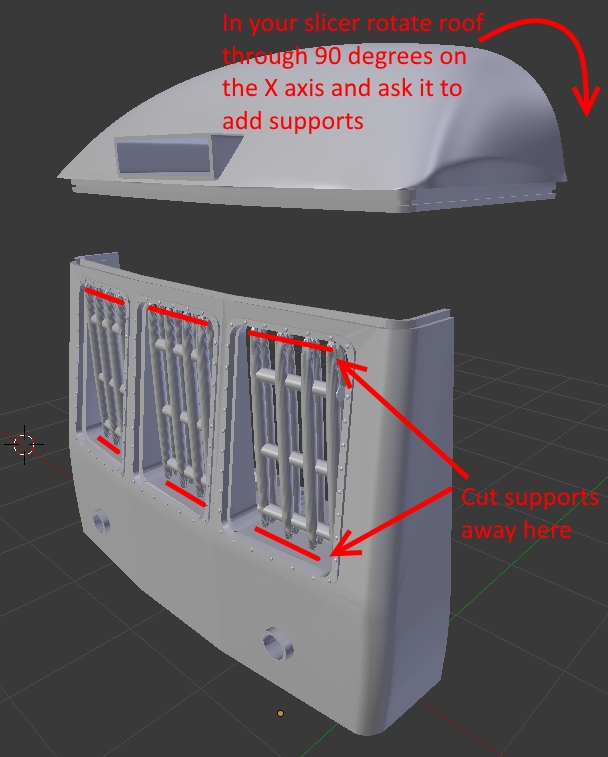
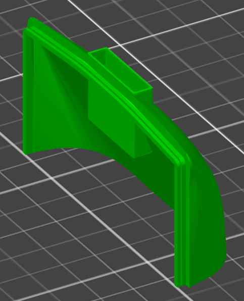

# Introduction

This repo contains the component files for 3D printing/milling/folding a Gauge 1 model of a Class 116 DMU, as would have run on the Rhymney Valley line in South Wales during the 1960s and 1970s.  This is all part of my Gauge 1 DMU project, which is described here:

http://www.meades.org/misc/gauge_1_dmu/gauge_1_dmu.html

Please refer to that page for more information.

# 3D Printed Parts
All of the 3D printed parts are rendered full-size in Blender.  For a Gauge 1 model they should be exported to STL scaled down by 30.45 times (at least, this was correct for my [Prusa](https://www.prusa3d.com/) 3D printer) in order to achieve 1/32nd scale.  Aside from corridor_joiner.blend (which requires a flexible material) I printed all the parts in ASA for UV-proofness.  I specified 20% fill in the slicer program.  Other slicer program settings are given in the descriptions below for each part.

ASA is more prone than PLA to come loose from the heat bed or warp during printing.  I found that if I kept the heat bed at 110 C throughout the print and kept the door of the cupboard in which my 3D printer is housed closed (in order to keep the air temperature relatively high) then I had no problems printing in ASA with my Prusa 3D printer.

## dmu_class_116.blend
This is a Blender file containing all of the other printed parts, plus colour and lighting, from a which a [video tour](https://youtu.be/fGLPumszhXk) was created.  This part is not for printing, simply for fun.

## cab_front_and_roof.blend
The front portion of the cab and the roof immediately above it as two parts which should be printed separately.  For the roof, rotate it in your slicer through 90 degrees on the X axis and ask the slicer to add supports.

The cab requires no added supports - they have been manually added to the object and should be cut away after printing as shown; slicers otherwise tend to over-add supports which are difficult to remove on such an intricate print.  Both parts should be printed in white ASA for ease of painting; 0.1 mm resolution appears to be sufficient but, if you have sufficient trust in your 3D printer, the cab front would benefit from, say 0.05 mm resolution (which was an 18 hour print on my Prusa printer).

## drivers_steps.blend
These are the steps that lead up to the drivers door, intended to be CA'ed to the front of the driver's-end bogie.  Print off two copies in black ASA; resolution is not important (I used the "0.10 mm detail" setting on my Prusa printer).  In your slicer program, turn them upside-down so that the large flat top surface is against the heat bed and set the slicer program to add supports everywhere.  The printed parts will be somewhat support-busy I'm afraid; take care when trimming the support away not to break the wanted part.  When fitting the steps on either side of the front bogie you may need to trim the portion that hooks over the top of the bogie on the inner-side so that it fits nicely and doesn't foul the wheels.

## chassis.blend
The chassis components, including:
- a box which will be held underneath the aluminium chassis plate (see below for that CNC-printed part) to hold the control electronics for the DMU,
- a piece which "jigsaw" attaches to that and will house the battery (held in place with Velcro straps) and fuse holder underneath the DMU,
- two chassis sides, each in two pieces, which "jigsaw" attach to the above two pieces and represent the detail of the chassis sides of both of the motorised cars.

There are also two pieces which would be glued/screwed under the aluminimum chassis plate of the trailer composite car.  The two chassis sides, again in two parts, of the trailer composite car would attach to these but I've not generated the trailer composite chassis sides yet.

These parts should all be printed in black ASA since that would work best for painting.  No supports are required provided the chassis sides are printed such that the sides with the detail on are pointing vertically upwards (i.e. the widest/flatest side is against the heat plate).  It may be advisable to set your slicer program to add a "brim" or "skirt" as the jigsaw edges of the ASA can sometimes rise up from the heatbed, giving a messy finish; a brim will help to stick them down.  The brim will be a pain to remove around the jigsaw edges but it's probably a good thing that this area gets some manual finishing so that you are sure there are no deformities to obstruct what will be a very tight joint.

I printed the chassis sides in 0.05 mm ultimate resolution and the rest in 0.2 mm fast resolution.

## buffer_bar.blend
This is the part to which the buffers etc. attach.  It should be printed in black ASA at 0.15 mm resolution, oriented as it comes, no supports required but it would probably benefit from a brim added in your slicer program.

## body_motor_open_second_*_section_*.blend
These files contain the body sections.  Number 1 is at the front, attached to the cab where present, number 5 at the back.  Each section should be printed rotated by 90 degress on the X-axis, so that the rear-most end of the section is resting on the heat plate and the corridor rises vertically upwards.  As with the cab front, all the required supports have been added manually (the bar-like cylinders); there is no need to add any in your slicer programme (apologies in advance that the supports are somewhat unstructured: they worked fine with PLA but then needed quite a few changes to remain stable when printing ASA).  Use a long-nosed pliers to break the supports away from the finished print; if they don't budge easily then cut away the parts closest to the body with a sharp knife first.  Take particular care with body_motor_open_second_*_section_2.blend which includes rather a large amount of support material, and body_motor_open_second_*_section_1.blend which is quite thin in the cab door area.  The body sections have generally been designed to be slightly longer than required so that, should any shrinking of the base occur during printing, it can be remedied during assembly.

On the taller sections, particularly section body_motor_open_second_*_section_2.blend, you should get your slicer program to add a brim in order to ensure that the piece stays firmly anchored to the heat plate for the entirety of the printing process.

I printed the body sections in white ASA at 0.15 mm resolution; they are quite large so printing in a higher resolution would take prohibitively long and, in any case, they are relatively sparse in detail.  Printing body sections 1 to 5 for a single DMU unit took around 50 hours on my Prusa 3D printer.

## corridor_joiner.blend
The corridor joiner, simply to be glued onto the origami part, see below.  Print at 0.15 mm resolution in black ASA.

## seats.blend
Passenger seats; print in white ASA, as they come, at 0.1 mm resolution, no supports required, though depending on how much you trust the adhesion of ASA on your heatbed you might wish to get your slicer to add a brim.  No finishing is required aside from a quick rough filing of the horizontal part of the seat surface since the ribs of the 3D print otherwise match those of the cloth.

## partitions.blend
The internal partitions.  There are three sorts: the front and read side of the passenger compartment divider and the driver's compartment divider.  They should be printed at 0.15 mm resolution in white ASA, no supports required, just make sure to lie them with the flat side against the heat plate (each partition has only one flat side).

## dmu_library.blend
This file is a collection of the various component parts I used in creating all of the above: the jigsaw pattern, body template, un-cut chassis sides, various punches for windows/hinges/door-stops etc.  Not to be printed in itself, just a useful repository of tools.

# CNC Milled Parts
These parts are milled from 3 mm thick aluminium plate (assumed in this file to be 100 mm wide by at least 622 mm long) on my [cnc-step.de](https://cnc.step.de) High-Z/S-400T CNC milling machine.  The file format is [VCarve](https://www.vectric.com/products/vcarve.htm).

* dmu_base_motor_open_second.crv: the chassis base for the motor open second.

The files for the motor open second brake and trailer composite units have not yet been generated; the only difference between the three files will be the position of the steps beneath the doors and the lack of the velcro strap slots.  The dimensions are scaled to cut out in 1:32 scale (i.e. you don't need to do any scaling, just print as-is).  The positions of three 6 mm holes are marked in the file; these must be drilled beforehand and are then used to anchor the job while cutting. It is likely you may have to "tile" the printing of the files into sections for your CNC milling machine as they may be too long to go through in a single cut. ALL OF THE FILES require a sacrificial substrate (e.g. a sheet of 3 mm thick MDF or hardboard) as they need to cut THROUGH the aluminimum plate.  2 mm and 4 mm end mills are required; run the 4 mm cuts first.  I ran the spindle at 14000 RPM and used [Only One PM60](https://www.cutwel.co.uk/milling-routing-and-sawing/general-purpose-milling-cutters/pm60-only-one-end-mills) end-mills from Cutwel.  I also found that, in the final "cut-out" cut with the 2 mm milling bit, I had to manually reduced the feed rate to 25% as, no matter what I did, I couldn't persuade VCarve to set my desired glacial feed rate of 0.5 mm/second in order to avoid damage to the tiny bit.  I saved the 4 mm toolpaths and the 2 mm toolpaths into separate files in two tiles each 311 mm long (i.e. two halves); these `.nc` toolpaths are also included.  If you go with my wimpy feed rates no cooling is required, though if you don't have an extractor it's worth vacuuming up the chips every now and then.

For reference, the X/Y origin point in the bottom left-hand corner should be 90/50 mm from the centre of the left-most 6 mm fixing hole; it is worth marking this origin point on the aluminium plate while you're drilling the fixing holes. If you're tiling as I have done, that's the origin of tile 1 and the origin of tile 2 is aligned with the centre of the middle 6 mm fixing hole and 50 mm south; again it is worth marking this point while you are drilling the fixing holes.  Write down the absolute X/Y coordinates of tile 1 once you've established them with the job fixed in your milling machine and then you can use exactly the same Y coordinate for tile 2 when the time comes.  Zero point Z should be the top of the aluminimum plate.  If tiling, watch the first layer of the first slot of the first tile being cut and check that the tool stops cutting in exact line with the centre fixing hole; if so you've set the X origin correctly, if not stop the cut, check it and start the run again (no need to change material, no over/underrun will matter at this point).  When the first layer of the second slot of the first tile is being cut, do a similar visual check, this time that the slots are evenly spaced either side of the central fixing hole.  Watch the end of the 2 mm cut-out cut of tile 2 as the tags between the wanted part and the outer waste portion of aluminium are quite slim and might break, leaving it to wash around, causing trouble; if this happens grab it with gloved hands and hope for the best.

# Origami Parts
The corridor joiners between the DMU sections is made from folded paper, the 3D printed corridor_joiner.blend end bits are then glued to each end and the whole is painted with black latex.  The file corridor_joiner.pdn is the original file paint.net format file while and corridor_joiner.jpg is a JPEG export.  Print the image 1:1 (i.e. no scaling) on plain paper and then [follow the instructions here](http://www.meades.org/misc/gauge_1_dmu/gauge_1_dmu.html) to fold and assemble it.